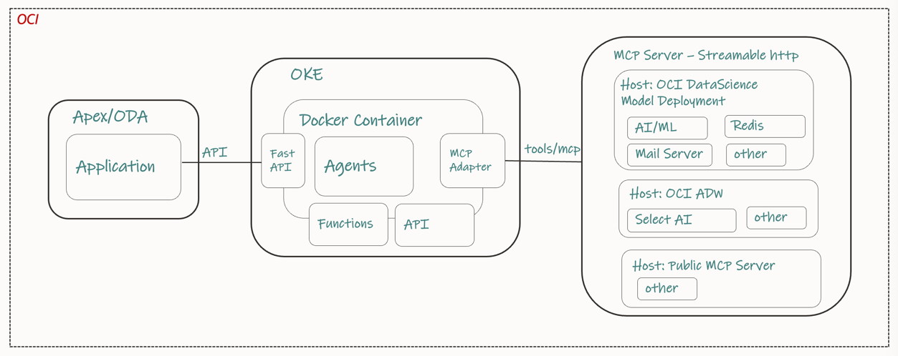

### Oracle Agent Development Kit (ADK) for building Agentic AI applications

#### Understanding the Agentic Framework: A Blueprint for Autonomous system
> https://github.com/aojah1/agents/blob/main/Agentic%20Framework_1.2_Feb03_MM_Anup.pdf

### ADK REFERENCE ARCHITECTURE

### Configure your development environment

### Clone the repository
git clone https://github.com/aojah1/adk_projects.git

### Optional commands
How to actually get Python 3.13 on macOS (change it for your machine)
    Option 1 : Homebrew (simplest)
    brew update
    brew install python@3.13          # puts python3.13 in /opt/homebrew/bin
    echo 'export PATH="/opt/homebrew/opt/python@3.13/bin:$PATH"' >> ~/.zshrc
    exec $SHELL                       # reload shell so python3.13 is found
    python3.13 --version              # → Python 3.13.x
    
    Option 2 : pyenv (lets you switch versions)
    brew install pyenv
    pyenv install 3.13.0
    pyenv global 3.13.0
    python --version                  # now 3.13.0

### Configuring and running the agent

    python3.13 -m venv .venv
    source .venv/bin/activate

### Installing all the required packages
#### After you create a project and a virtual environment, install the latest version of required packages:

    python3.13 -m pip install -r requirements.txt

### Authenticating your ADK app to OCI
#### The ADK provides an AgentClient class to simplify handling authentication and management of agent resources. Four authentication types are supported:

### API Key Authentication (Default)
#### API key authentication is the default and most common method for authenticating with OCI services, and this is what we will be using in this project.

from oci.addons.adk import AgentClient

client = AgentClient(
    auth_type="api_key",
    profile="DEFAULT",
    region="<your-region>"  # OCI region such as "us-chicago-1" or airport code such as "ORD"
)

### Configuring your .env (config) file
Rename the adk_projects/config/sample_.env to adk_projects/config/.env 

Change the config variables based on your agents requirements

### Configuring and running an agent - Quick Test

    python3.13 -m src.examples.test_setup  

### Best practices to follow while building an agent. 
#### Below, you will see how to build an agent called 'taxagent' that has 2 tools - RAG Tool and a CustomFunction

#### Step 1: Build the tools required.

CustomFunction --> 

    src/tools/custom_function_tools.py

RAG Tool --> 

    oci.addons.adk.tool.prebuilt import AgenticRagTool

#### Step 2: Build/Deploy the Agent - taxagent to GenAI Agent Service to manage deployment

    python3.13 -m src.agents.taxagent

#### Step 3: Run/Test the API that will invoke the Agents deployed through GenAI Agent Service (remote)

    python3.13 -m src.app.tax_assistant.api_taxagent 

#### Step 4: Run a streamilt app to execute the agent

    python3.13 -m streamlit run src/app/tax_assistant/ui_taxagent.py

sample prompt : get tax m&e adjustment for entity 1000

#### Extra : If you want to learn how to expose an agent using FastAPI

    python3.13 -m uvicorn src.app.orderxhub.fastapi_orderx:app --reload

### Available OOB Tools from this repo

#### business_objects_tools :
> retrieve data from application database and perform transactions on application business objects as defined in the application OpenAI Spec

#### custom_function_tools :  
> Custom functions based on Agents requirements

#### deeplink_tools : 
> Send an end user to user form interface to perform specific actions along with the required context

#### document_tool : 
> upload or reference unstructured documents for semantic search and retrieval upon which to ground an answer or response

#### email_tools : 
> Enable an Agent to write and send an email to a human receipt

#### external_REST_tools : 
> Connect to any service to integrate any data and functionality with a public REST interface

#### oci_rag_service_tools : 
> OCI RAG agent pre-built service as a tool

#### slack_tools : 
> Enable an Agent to write and send a slack message to an organization channel

#### speech_instruct_tools : 
> Convert Speech to Text tool

#### vision_instruct_tools : 
> Convert Image to Text tool

### Prompt Engineering
> Topics: 
>> Topics define the scope, intent and purpose of an Agent. Topics further refine the Agent's scope and purpose - this is added to the system prompt in instructing an LLM 
Use a consistent pather
Subject Area >> Intent Recognition >> Conversational Flow >> Tool/System integrations >> Contextual Responses

> System Prompt:
>> Each agent has a system prompt. The system prompt defines the Agents personas and capabilities. It establishes the tool it can access. It also describe how the Agent should think about achieving any goals or task for which it was designed.
Use a consistent pattern : 
CONTEXT >> ROLE >> OBJECTIVE >> FORMAT >> TONE / STYLE >> CONSTRAINTS

### Agents
> Agents handles specific task and is equipped with specific skills that enables it to carry out task. Consider this as a worker behind the scenes to perform actual actions or task that the agent is suppose to deliver to the user.
Agent can connect to other systems, API's or tools, which allows the agent to utilize information from different data sources or business functions.

### Agent Teams
> A structured sequence of steps or actions that the AI Agent follows to accomplish a specific business task or answer a user query.
Workflow patterns such as Supervisor and Swarm makes up an Agent Team.

### Applications
> An application is what gets deployed at the client side, for users or machines to interact with.
> Apps can be exposed either as an API or a UI.

### llm
> One common place to configure all LLMs the application is going to leverage.

### METRO
> MONITORING >> EVALUATION >> TRACING >> REPORTING > OBSERVABILITY

### MCP Server - 
Follow this instruction on how to deploy your tools into Oracle DataScience using MCP architecture

https://blogs.oracle.com/ai-and-datascience/post/hosting-mcp-servers-on-oci-data-science

### MCP Client - 
oci-2.154.1+preview.1.228

##### -- Author: Anup Ojah, HPC&AI Leader, Oracle Cloud Engineering
##### References:
https://docs.oracle.com/en-us/iaas/Content/generative-ai-agents/adk/api-reference/introduction.htm

https://www.oracle.com/applications/fusion-ai/ai-agents/

https://docs.oracle.com/en/solutions/ai-fraud-detection/index.html
